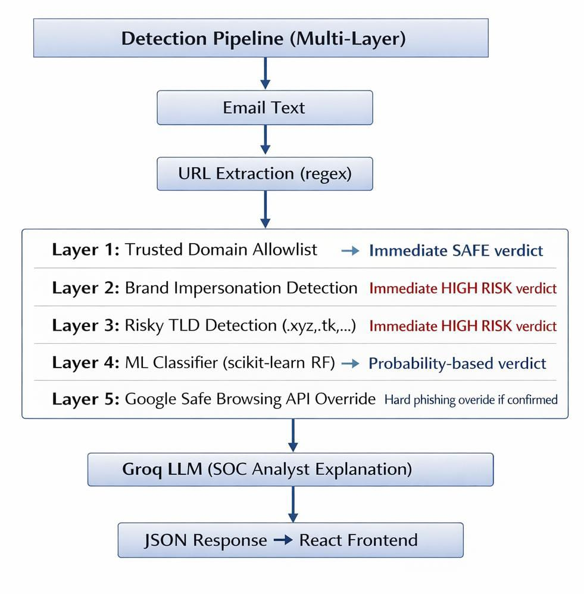
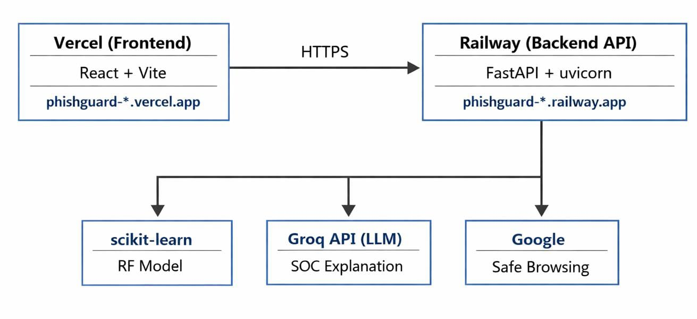

#  PhishGuard Security Copilot

> **AI-powered phishing detection for enterprise email security.**  
> Built with FastAPI · scikit-learn · Google Safe Browsing · Groq LLM · React + Vite

[](https://phishguard-security-copilot-f4n5.vercel.app)
[](https://phishguard-security-copilot-production.up.railway.app/docs)

---

## 🚀 What is PhishGuard?

PhishGuard is an enterprise-grade phishing detection copilot. You paste a suspicious email, it extracts every URL, runs it through a multi-layer detection pipeline, and returns a risk verdict with an AI-generated SOC analyst explanation — all in seconds.

Built as a solo student project from scratch: data collection, model training, API design, frontend, and full cloud deployment.

---

##  Detection Pipeline (Multi-Layer)





---

## ⚙️ Tech Stack

### Backend
| Component | Technology |
|---|---|
| API Framework | FastAPI (Python) |
| ML Model | Random Forest Classifier (scikit-learn) |
| ML Features | 30 URL structural features (Phishing Dataset url sourced from kaggle) |
| LLM Explanation | Groq API (`moonshotai/kimi-k2-instruct-0905`) |
| Threat Intel | Google Safe Browsing API v4 |
| SIEM Simulation | CSV-based click log lookup |
| Rate Limiting | SlowAPI (10 req/min) |
| Deployment | Railway (Nixpacks, uvicorn) |

### Frontend
| Component | Technology |
|---|---|
| Framework | React 18 + Vite |
| Styling | Vanilla CSS (glassmorphism dark theme) |
| Fonts | Inter + JetBrains Mono (Google Fonts) |
| Deployment | Vercel |

---

##  Features

- **Multi-layer phishing detection** — trusted allowlists, brand impersonation detection, risky TLD checks, ML model, and Google Safe Browsing hard override
- **30-feature URL analysis** — IP detection, SSL check, WHOIS domain age, subdomain depth, shortener detection, and more
- **Brand impersonation guard** — detects paypal/google/microsoft/amazon/apple/facebook/netflix spoofing in domains
- **LLM-generated SOC explanation** — Groq generates a short enterprise risk summary for each verdict
- **SIEM simulation** — checks if any users have clicked the flagged URL (simulated click logs)
- **Rate limiting** — 10 requests/minute per IP to prevent abuse
- **CORS-protected** — only the deployed Vercel frontend and localhost are allowed
- **Responsive UI** — works on mobile and desktop


---

##  Architecture





---

##  API Endpoints

| Method | Endpoint | Description |
|---|---|---|
| `GET` | `/health` | Health check |
| `POST` | `/analyze-email` | Analyze email text for phishing URLs |
| `GET` | `/docs` | Interactive Swagger UI |

### Example Request
```bash
curl -X POST https://phishguard-security-copilot-production.up.railway.app/analyze-email \
  -H "Content-Type: application/json" \
  -d '{"email_text": "Click here to verify: http://paypal-login-verification.com/security-check"}'
```

### Example Response
```json
{
  "extracted_urls": ["http://paypal-login-verification.com/security-check"],
  "analysis": [{
    "url": "http://paypal-login-verification.com/security-check",
    "prediction": "phishing",
    "confidence": 0.92,
    "risk_level": "high",
    "signals": ["brand_impersonation", "non_secure_protocol"],
    "decision_summary": "High-risk phishing due to brand impersonation",
    "explanation": "...",
    "siem_alert": {}
  }]
}
```

---

##  Training the ML Model

The classifier was trained on a phishing URL dataset sourced from Kaggle, using 30 engineered structural URL features such as URL length, subdomain depth, special characters, SSL presence, and domain-based signals.

```bash
cd training
python train_classifier.py
```

Model: **Random Forest Classifier** — saved to `models/phishing_classifier.pkl`

---
## Model Performance

Evaluated on a held-out test set (2,211 samples) from the UCI Phishing Websites Dataset:

| Class       | Precision | Recall | F1 Score |
|-------------|-----------|--------|----------|
| Legitimate  | 0.98      | 0.97   | 0.97     |
| Phishing    | 0.97      | 0.98   | 0.98     |
| **Overall** | **0.98**  | **0.98**| **0.98**|

> High recall on phishing class (0.98) means the model misses very few actual 
> phishing URLs — critical for a security tool where false negatives are costly.
---

##  Environment Variables

### Backend (Railway)
| Variable | Description |
|---|---|
| `Groq_API_KEY` | Groq API key for LLM explanations |
| `GOOGLE_SAFE_BROWSING_KEY` | Google Safe Browsing API v4 key |

### Frontend (Vercel)
| Variable | Description |
|---|---|
| `VITE_API_URL` | Railway backend URL (no trailing slash) |

> ⚠️**Note:** Vite injects env vars at **build time**. If you update `VITE_API_URL` on Vercel, you must trigger a fresh redeploy (no cache) for it to take effect.

---

##  Deployment

| Service | Platform | URL |
|---|---|---|
| Backend API | Railway | `phishguard-security-copilot-production.up.railway.app` |
| Frontend | Vercel | `phishguard-security-copilot-f4n5.vercel.app` |

---

## 📝 Local Development

```bash
# Clone the repo
git clone https://github.com/spoorthinavale4-cmyk/phishguard-security-copilot.git
cd phishguard-security-copilot

# Set up backend
pip install -r requirements.txt
cp .env.example .env   # Add your API keys
uvicorn api.main:app --reload

# Set up frontend (separate terminal)
cd client
npm install
cp .env.example .env.local   # Set VITE_API_URL=http://localhost:8000
npm run dev
```

---

##  Known Limitations

- WHOIS lookups on some domains are slow (~2–3s) — acceptable for security tooling
- LLM explanation adds ~1–2s latency per URL (Groq free tier)
- SIEM data is simulated (CSV-based) — would connect to a real SIEM in production
- Brand list currently covers 7 major brands — easily extensible

---

##  About

Built by **Spoorthi AG** as a student project exploring the intersection of machine learning and cybersecurity.

> *Full disclosure: every API key used in this project is running on a free tier.*  
> *The Groq LLM key has seen things. Dark things. Hundreds of phishing URLs at 2am.*  
> *It still works. Barely. But it works.* 😅

---

## 📄 License

MIT License — feel free to fork, extend, and build on this!
